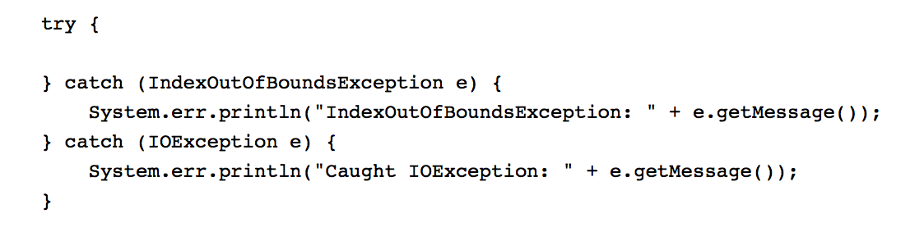

## Unique features of the language
  * Java features include:
    * Objects are the primary unit of composition
    * There are no standalone functions
    *	Design patters can be used to describe high level object coordination patterns
  * Swift features include:
    * Functions and closures are fist-class types: Functions and Closures
    * Subscripts that basically overrides the operator[]: Subscripts
    * No implicit type cast
## Instance reference name in data type (class)
  * Java: Uses “this” to a reference to the current object. It is used to refer to any member of the current object from      within an instance method or a constructor.
  
  * Swift: Uses “self” to refer to an instance variable that is shadowed by a parameter name. It is a reference to the current class.
  
## Reflection
  * Java: It can be used to map properties in JSON files to getter and setter methods in various Java objects. It is used to inspected classes, interfaces, fields and methods at runtime without knowledge of the classes, methods, etc. at compile time.
  
  * Swift: Swift uses the capabilities of reflection based around the struct named “Mirror.” It describes the parts that make up a particular instance, such as the instance’s stored properties, collection or tuple elements, or its active enumeration case. It also has a “display style” property that suggests how this mirror may be rendered.
  
## Errors and exception handling
  * Java: Java uses the try/catch/finally block to handle errors and exceptions. It is essentially another way of creating an if/else statement that handles the exception via catch/finally block if that error is present.
  
  * Swift: Errors are types of values that confirm to the Error protocol. It is used to indicate that a type can be used for error handling. Swift often uses enumerations to group of related error conditions.
  
  .png)
## Procedural programming
  * To understand if the languages support procedural programming, it is important to identify what it is and how it relates to certain OOP languages; Procedural programming is an imperative programming language whose programs can be primarily structured in term of re-usable code such as subroutines and/or functions.
  * Java: Yes. It takes an imperative approach of how to perform algorithms and how to track changes in state.
  * Swift: No. Swift supports functional programming, which is a declarative programming that was explicitly created to support a pure functional approach to problem solving.

  
